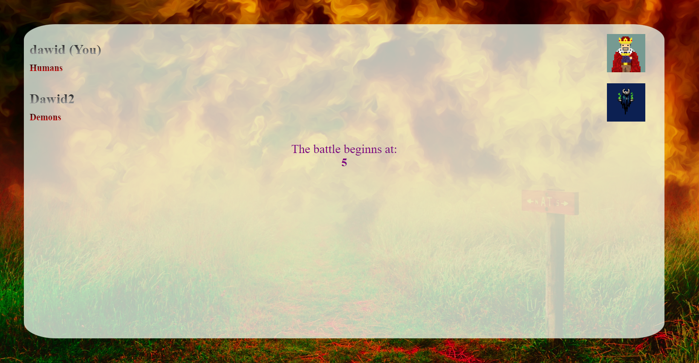

# 🎮 **Plains of Aestria** 🎮
## 🃏🧑‍🤝‍🧑 3D Multiplayer card game
### Game created with #VoidFrog 🐸

### 🤖 Used technologies:
- [x] Node.js
- [x] Express.js
- [x] Socket.io
- [x] JsonWebToken
- [x] THREE.js
- [x] Tween.js

### 🚀 How to start server on your local machine
1. Open project and add .env file in main directory
2. Add MONGODB_URL, TOKEN to your .env file
3. Check your connection with data base
4. Login/Register and enjoy the game 🎲

### 🖼️ **Images of the game** 

